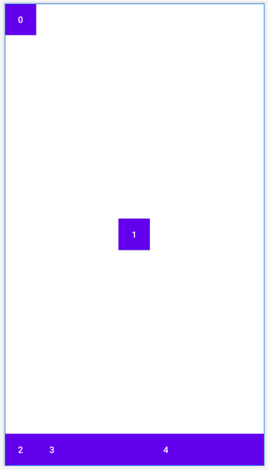

# Android-layout

# 1. LinearLayout
容器
LinearLayout is a view group that aligns all children in a single direction, vertically or horizontally.

```
<LinearLayout
      xmlns:android="http://schemas.android.com/apk/res/android"
      android:layout_width="match_parent"
      android:layout_height="match_parent">
    ... // add UI controls
 </LinearLayout>
```

Why 'http://schemas...' must be the first in the layout xml file?
This is XML Name Space declaration. XML namespaces are used for providing uniquely named elements and attributes in an XML document. xmlns:android describes the android namespace.  

** gravity vs layout_gravity vs layout_weight ** :  
*android:gravity* : for parent view. sets the gravity of the contents (i.e. its subviews) of the View it's used on.  
*android:layout_gravity* : for child view group. sets the gravity of the View or Layout relative to its parent. Can only control a small part of area.  
*android:layout_weight* specifies how much of the extra space in the layout to be allocated to the View. Usually use **android:height = 0dp** and only use **layout_weight** to control vertical space.

# 2. RelativeLayout
RelativeLayout is a view group that displays child views in relative positions. The position of each view can be specified as relative to sibling elements (such as to the left-of or below another view) or in positions relative to the parent RelativeLayout area (such as aligned to the bottom, left or center).    
If you find yourself using several nested LinearLayout groups, you may be able to replace them with a single RelativeLayout.  
```
<!--    relative to parent-->
    <RelativeLayout
        android:id="@+id/rl1"
        android:background="@color/design_default_color_primary_variant"
        android:layout_width="100dp"
        android:layout_height="50dp"
        android:layout_centerInParent="true" />

    <!--  relative to friend, needs a specific id -->
    <!--  layout_marginLeft: distance with parent -->
    <RelativeLayout
        android:background="@color/design_default_color_secondary"
        android:layout_width="100dp"
        android:layout_height="50dp"
        android:layout_toLeftOf="@+id/rl1"
        android:layout_marginLeft="100dp"
        android:layout_marginTop="50dp"/>
```

## 2.1 margin vs padding
In simple words, margin means to push outside, whereas padding means to push inside.  

Padding is the space inside the border, between the border and the actual view's content. Note that padding goes completely around the content: there is padding on the top, bottom, right and left sides (which can be independent).  

Margins are the spaces outside the border, between the border and the other elements next to this view. In the image, the margin is the grey area outside the entire object. Note that, like the padding, the margin goes completely around the content: there are margins on the top, bottom, right, and left sides.  

# 3. FrameLayout
FrameLayout is designed to block out an area on the screen to display a single item.  

# 4. GridLayout
More flexible than TableLayout.  
Below image shows that each row has 3 columns, row 1 spans 3 columns and gravity is center. Button 4 takes all rest width because its column weight is 1 while others are 0.  

<p align="center">

</p>

```
<GridLayout xmlns:android="http://schemas.android.com/apk/res/android"
    android:layout_width="match_parent"
    android:layout_height="match_parent"
    android:orientation="horizontal"
    android:columnCount="3">
    <Button
        android:text="0"
        android:background="@color/design_default_color_primary_variant"
        android:layout_width="50dp"
        android:layout_height="50dp" />
<!--    use layout_columnSpan with layout_gravity-->
    <Button
        android:text="1"
        android:background="@color/design_default_color_secondary"
        android:layout_column="0"
        android:layout_row="1"
        android:layout_width="50dp"
        android:layout_height="50dp"
        android:layout_columnSpan="3"
        android:layout_gravity="center"/>
    <Button
        android:text="2"
        android:background="@color/design_default_color_surface"
        android:layout_width="50dp"
        android:layout_height="50dp" />
    <!--        if goes beyond current row, do not show it-->
    <Button
        android:text="3"
        android:background="@color/design_default_color_error"
        android:layout_width="50dp"
        android:layout_height="50dp" />
    <Button
        android:text="4"
        android:background="@color/design_default_color_secondary"
        android:layout_width="50dp"
        android:layout_columnWeight="1"
        android:layout_height="50dp" />
</GridLayout>
```

# 5. TableLayout
TableLayout containers do not display border lines for their rows, columns, or cells.  
cannot combine 2 rows, can only combine 2 columns.  

```
<!--    collapseColumns: hide specific column-->
<!--    stretchColumns: only work when there is empty space-->

<TableLayout xmlns:android="http://schemas.android.com/apk/res/android"
    android:layout_width="match_parent"
    android:collapseColumns="0"
    android:stretchColumns="1"
    android:shrinkColumns="3"
    android:layout_height="match_parent">

    <TableRow>
        <Button
            android:text="button 0"
            android:background="@color/design_default_color_primary_variant"
            android:layout_width="50dp"
            android:layout_height="50dp" />
        <Button
            android:text="button 1"
            android:background="@color/design_default_color_secondary"
            android:layout_column="1"
            android:layout_width="50dp"
            android:layout_height="50dp" />
        <Button
            android:text="button 2"
            android:background="@color/design_default_color_surface"
            android:layout_width="50dp"
            android:layout_height="50dp" />
<!--        if goes beyond current row, do not show it-->
        <Button
            android:text="button 3"
            android:background="@color/design_default_color_error"
            android:layout_width="50dp"
            android:layout_height="50dp" />
        <Button
            android:text="button 4"
            android:background="@color/design_default_color_secondary"
            android:layout_width="50dp"
            android:layout_height="50dp" />
    </TableRow>
</TableLayout>
```

# 6. ConstraintLayout
A ConstraintLayout is a android.view.ViewGroup which allows you to position and size widgets in a flexible way.  
drag four directions to left, up, bottom, right, then button is center.  
Use guideline if you need to align to center.

<p align="center">

</p>

<p align="center">

</p>

```
<androidx.constraintlayout.widget.ConstraintLayout xmlns:android="http://schemas.android.com/apk/res/android"
    xmlns:app="http://schemas.android.com/apk/res-auto"
    xmlns:tools="http://schemas.android.com/tools"
    android:layout_width="match_parent"
    android:layout_height="match_parent">

    <Button
        ... />

</androidx.constraintlayout.widget.ConstraintLayout>
```