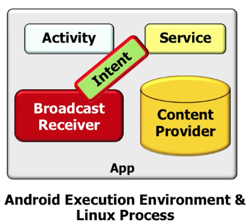

# Android Basics

# 1. Overview

## 1.1 hardware
sensors
tranceivers
storage: RAM, flash memory
processors: CPU

# 1.2 Android APP Components

Intent: messages that describe an action to perform or an event that has occurred. The glue that simplifies implementation of Apps that reuse existing components.  
Activity: provide a screen which users can interact in order to do something  
Broadcast Receiver: event handlers that respond to broadcast announcements  
Services: run in background to perform long-running operations or access remote resources  
Content Provider: manage access to structured data & provide data security mechanism   

Java Threads: smallest units of execution for sequences of programmed instructions. Each process can have multiple threads that run concurrently.

runnable interface

java 8 lambda function

#1.3 Application code vs framework code
An intent is a message one component uses to interact with—or request functionality from—other component(s)
An intent is implemented as a “passive” data structure. It just consists of fields & field accessor/ mutator methods & isn’t “object-oriented”.

Apps can use intents to describe two types of things:
(1) An operation to perform
(2) An event that has occurred

late run-time binding: components can be discovered & used at runtime vs. compile-time

The component->process mapping can be configured declaratively via the AndroidManifest.xml file

Element
Purpose
Name
Name for a component to handle intent (optional)
Action
A string naming the operation to perform or in case of broadcast intents the event that has occurred & is being reported
Data
URI of data to be acted on & the MIME type of that data
Category
String giving additional info about the action to execute
Extras
Key-value pairs for additional information that should be delivered to component handling the intent
Flags
Flags of various sorts

